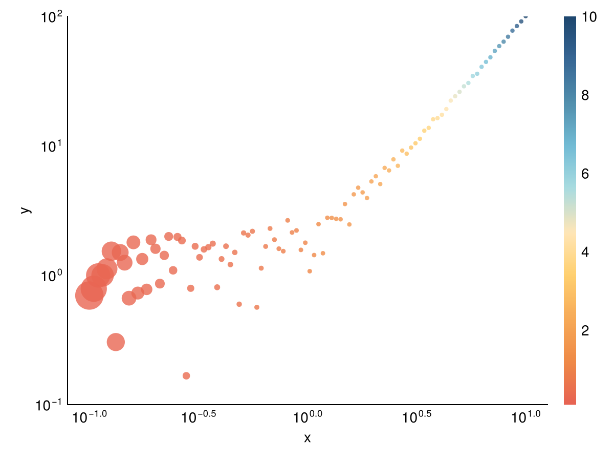

<!-- README.md is generated from README.Rmd. Please edit that file -->

```{r, include = FALSE}
knitr::opts_chunk$set(
  collapse = TRUE,
  comment = "#>",
  fig.path = "man/figures/README-",
  out.width = "100%"
)
```

# tidierplots

<!-- badges: start -->
<!-- badges: end -->

tidierplots is a wrapper for [TidierPlots.jl](https://github.com/TidierOrg/TidierPlots.jl), a reimplementation of [ggplot2](https://ggplot2.tidyverse.org/index.html) in [julia](https://julialang.org/). It allows you to use ggplot syntax to generate plots using a julia backend powered by [Makie.jl](https://docs.makie.org/stable/)

## Installation

You can install the development version of tidierplots like so:

``` r
devtools::install_github("rdboyes/tidierplots")
```

## Syntax Differences

Use pipes (`|>`) instead of `+` to chain `ggplot` components, and use strings in your `aes` calls to refer to variable names. 

## Example

```{r example}
library(tidierplots)

xs = 10 ^ (seq(from = -1, to=1, length.out=100))

df = data.frame(x = xs,
    y = xs ^ 2 + abs(2 * runif(length(xs))),
    size = rev((xs ^ 2/3) + 6))

ggplot(df) |>
    geom_point(aes(x = "x", y = "y", size = "size", color = "x"), alpha = 0.8) |>
    scale_x_log10() |>
    scale_y_log10() |>
    labs(x = "x", y = "y") |>
    lims(y = c(.1, 100)) |>
    scale_color_continuous(palette = "Hiroshige", name = "") |>
    theme_minimal()
```

